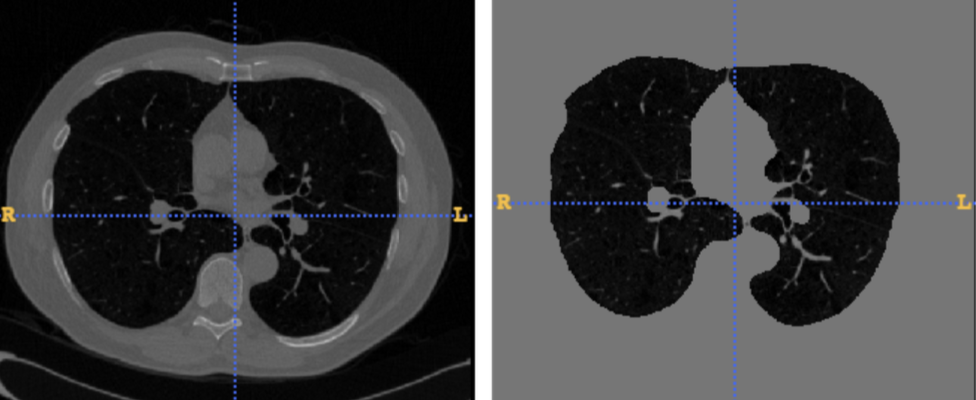
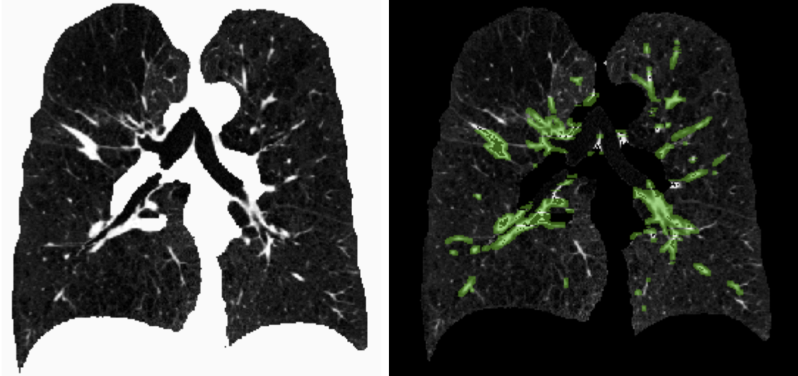
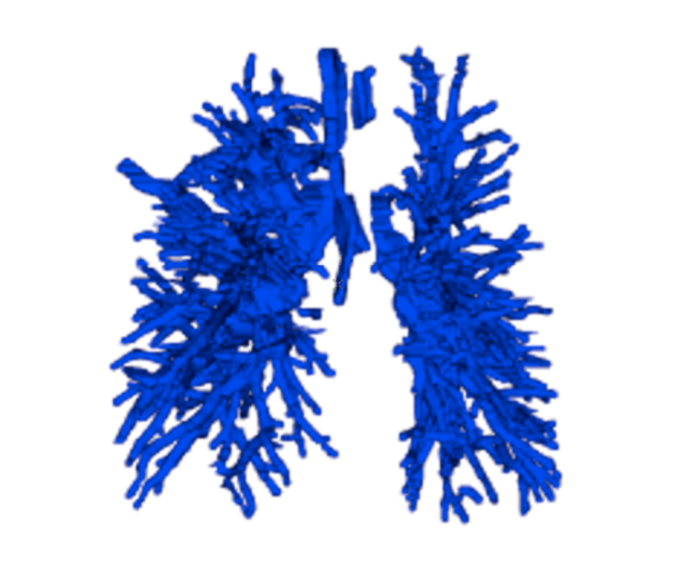
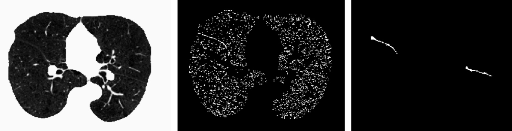
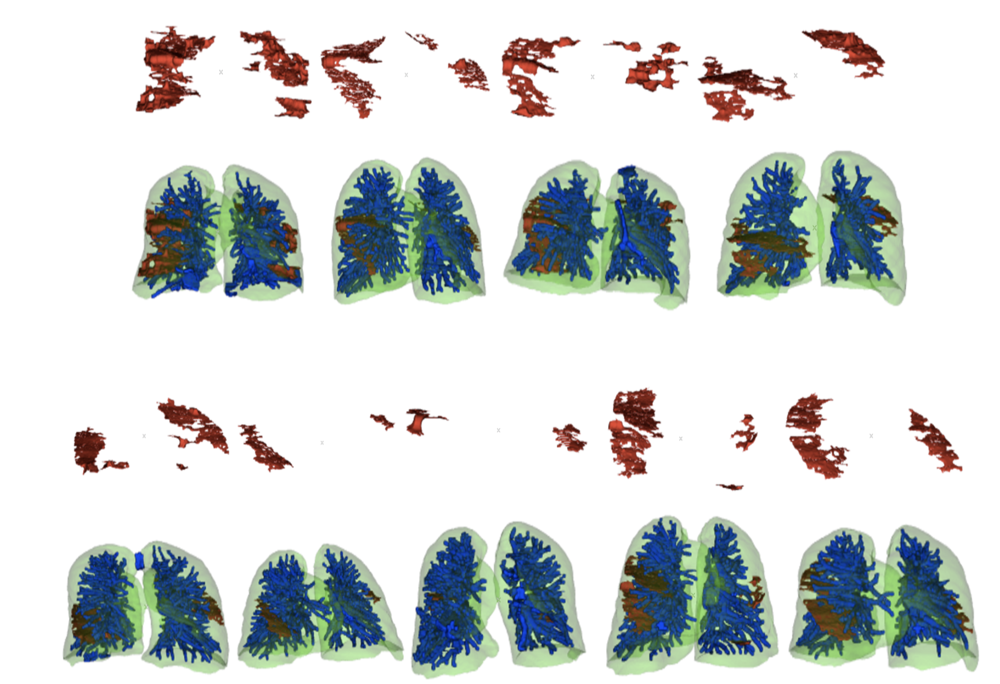

# Lung-Lobes-Segmentation-in-CT-Scans

Python and C++ implementation on vessel and fissure segmentation in Lung CT Scans based on [Bianca's work](https://pdfs.semanticscholar.org/ddd9/8a73eab745841ba41a13633be76ab1f9c8b0.pdf)

## Usage
**For lung and pulmonary vessel segmentation**
I create a ipython notebook for this part (in lung_segmentation.ipynb except the last two parts).

***For pulmonary fissure segmentation*
Compile the two C++ files for fissure segmentation.
1. cmake .
2. make
3. 
	Use vector-based region growing for fissure segmention. 
	```Python
	./vector_region_growing INPUT_FILE_NAME OUTPUT_FILE_NAME
	```
	Use intensity-based region growing for removing small regions.
	```Python
	./region_growing INPUT_FILE_NAME OUTPUT_FILE_NAME
	```
4. Running the last two sections in the ipython notebook to generate fissure mask and final lung-vessel-fissure mask. 

## Results
The result of lung segmentation:  


----

The result of vessel segmentaton:  



And in 3D view:  


----

The result of fissure segmentation: 
(original, after vector-based region growing, after intensity-based region growing)



The 3D maps of Lung-Vessel-Fissure for 9 cases:  



## Dataset
The dataset I used is [LOLA11](https://lola11.grand-challenge.org), which contains 55 CT Scans. 